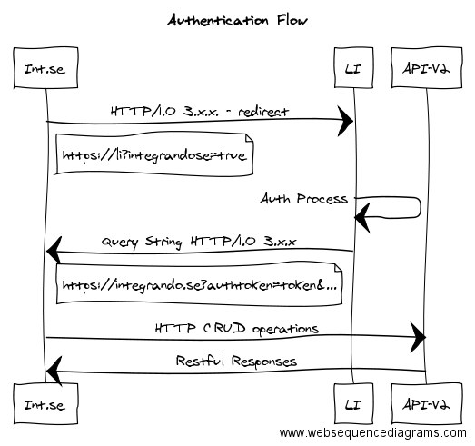

# Loja Integrada API V2 - Beta

API experimental utilizada para gerenciar e administrar os recursos disponíveis na Loja Integrada.

# Autenticação - integrando.se

```python
import json

jwt_example_token = '''eyJhbGciOiJIUzI1NiIsInR5cCI6IkpXVCJ9.\
eyJzdG9yZSI6eyJwaG9uZSI6Iis1NSgxMSk5MTM4Mi0xMjkzIiwiZG9tYWluIjoiMjRob3Vycy5jb20iLCJ2ZXJpZmllZCI6dHJ1ZSwiaXNfY29tcGFueSI6IlBKIiwiYWRkcmVzcyI6eyJjb21wbGVtZW50IjoiRG8gbGFkbyBkbyBGQkkiLCJ6aXBjb2RlIjoiMDM1ODYtMDAwIiwibnVtYmVyIjoiNzU2In0sImRvY3VtZW50IjoiMzM1LjAxMC43NzgtODIiLCJpZCI6MTAxMjMsInRlbXBfZG9tYWluIjoidGVtcG9yYXJpby0yNGhvdXJzLmxvamFpbnRlZ3JhZGEuY29tLmJyIn0sInVzZXIiOnsibmFtZSI6IkphY2sgQmF1ZXIiLCJlbWFpbCI6ImphY2suYmF1ZXJAMjRob3Vycy5jb20ifSwiZXhwIjoxNDY3MDM0Nzk2fQ.\
OH8mfcYEk5TABUwzCq3Gj8FVhfc4KatPsHIAsX-eEzs'''
header, payload, verify = jwt_example_token.split('.')
# Necessário para conseguir decodificar a string em base64
payload += "=" * ((4 - len(data) % 4) % 4)
payload_dict = json.loads(payload.decode('base64'))
print payload_dict['store']['domain'] # '24 hours'
```

> Ao decodificar o token a seguinte estrutura em JSON é retornada

```json
{
  "store": {
    "phone": "+55(11)91382-1293",
    "domain": "24hours.com",
    "verified": true,
    "is_company": "PJ",
    "address": {
      "complement": "Do lado do FBI",
      "zipcode": "03586-000",
      "number": "756"
    },
    "document": "335.010.778-82",
    "id": 10123,
    "temp_domain": "temporario-24hours.lojaintegrada.com.br"
  },
  "user": {
    "name": "Jack Bauer",
    "email": "jack.bauer@24hours.com"
  },
  "exp": 1467034796
}
```

O processo de autenticação consiste em obter um token de autenticação válido por 6 horas, para obtê-lo o usuário precisa ser redirecionado para o painel da Loja Integrada, após a validação das credenciais o usuário será encaminhado para um endereço pré configurado. O token pode ser obtido através da query string. Abaixo segue uma imagem exemplificando o fluxo de autenticação:



O fluxo pode ser descrito nos seguintes passos:

- Redirecionar o usuário para `https://app.lojaintegrada.com.br?integrandose=true`;
- O usuário fornece as credenciais no painel da Loja Integrada e as confirma;
- Um novo token é gerado e a página é redirecionada para um endereço pré configurado;
- A partir desse ponto é possível obter o `auth_token` da query string.

# Temas

## Instala novo tema

```python
import requests, json, base64

api_url = 'https://api.awsli.com.br/v2/themes'
auth_token = 'JWT_AUTH_TOKEN' # JWT Token extraido do query string
headers = {
  'Content-Type': 'application/json',
  'Authorization: Bearer %s' % auth_token
}

data_params = {
  'name': 'clean-store-black-edition-v1',
  'powered_by': 'Integrandose',
  # Não deve ter o nome .lojaintegrada
  'store_model': 'temporario-24hours',
  'description': 'Tema Mr. Black all Night Baby',
  'bundle_metadata': {
    'images': [
      'bg_direction_nav-1.png', 'bg_direction_nav.png',
      'hover-products1.png', 'imagem-chamada.jpg',
      'logo-integrando.se.png', 'screenshot-1.jpg'
    ],
    'css_file': 'custom.css',
    'js_file': 'functions.js'
  }
}

# Encoda arquivo .zip em base64
with open('clean-store-black-edition.zip', 'rb') as f:
  data_params['bundle'] = base64.b64encode(f.read())

# Instala e ativa o novo tema
response = requests.post(api_url, data=json.dumps(data_params), headers=headers)
if response.status_code == 201:
  print 'Tema instalado com sucesso'

print json.dumps(response.json(), indent=2)
```

> A resposta irá retornar a seguinte estrutura em JSON

```json
{
  "response": {
      "theme_id": 42
  }
}
```

Esse endpoint instala um novo tema para o lojista

### HTTP Request

`POST http://api.awsli.com.br/v2/themes/`

### Data Params

Parâmetro | Tipo | Requerido | Descrição
--------- | ---- | --------- | ---------
name | string(unique) | Sim | O nome do tema
powered_by | string | Não | O autor do tema
store_model | string | Sim | O endereço da loja onde o tema base esta instalado. Deve ser apenas o subdomínio sem o nome `.lojaintegrada`
bundle | base64 | Sim | O arquivo zip contendo a estrutura dos temas
description | base64 | Sim | Descrição do tema

### Data Params - bundle_metadata
Parâmetro | Tipo | Requerido | Descrição
--------- | ---- | --------- | ---------
images | list | Sim | Lista de strings contendo o nome das imagens
css_file | string | Sim | Nome do arquivo css
js_file | string | Sim | Nome do arquivo javascript

O nome do tema modelo deve ser único, caso já exista um tema modelo com esse nome um erro irá ocorrer informando a inconsistência.

<aside class="notice">Qualquer referência a {{PATH}} no arquivo css será substituido pelo caminho do CDN.
Exemplo: url({{PATH}}/minha.img) -> url(https://cdn.awsli.com.br/temasv2/minha.img)</aside>

### Status Code Responses

Código | Descrição
------ | ---------
201 | Created -- Tema foi criado e ativado com sucesso
400 | Bad Request -- Ocorreu um erro ao instalar o tema
404 | Bad Request -- A loja modelo não existe
409 | Conflict -- A loja modelo já está cadastrada como tema

## Atualiza tema `não implementado`

Esse endpoint atualiza os atributos e arquivos do tema.

```python
import requests
import json

api_url = 'https://api.awsli.com.br/v2/themes/42'
auth_token = 'JWT_AUTH_TOKEN' # # JWT Token extraido do query string
headers = {
  'Content-Type': 'application/json',
  'Authorization: Bearer %s' % auth_token
}
data_params = {}

# Encoda arquivo .zip em base64
with open('clean-store-black-edition-v2.zip', 'rb') as f:
  dadata_params['bundle'] = base64.b64encode(f.read())

# Atualiza o bundle do tema
response = requests.put(api_url, data=json.dumps(data_params), headers=headers)
if response.status_code == 204:
  print 'Tema atualizado com sucesso'

data_params = {'powered_by' : 'Integrandose-v2'}

# Atualiza o autor do tema
response = requests.put(api_ul, data=json.dumps(data_params))
if response.status_code == 204:
  print 'Tema atualizado com sucesso'
```

### HTTP Request

`PUT http://api.awsli.com.br/v2/themes/:ID`

### Query Params - Store

Parâmetro | Tipo | Requerido | Descrição
--------- | ---- | --------- | ---------
ID | integer | Sim | O ID da loja

### Data Params

Parâmetro | Tipo | Requerido | Descrição
--------- | ---- | --------- | ---------
powered_by | string | Não | O autor do tema
bundle | base64 | Sim | O arquivo zip contendo a estrutura dos temas

### Status Code Responses

Código | Descrição
------ | ---------
204 | No Content -- Tema atualizado com sucesso
400 | Bad Request -- Erro ao atualizar tema
404 | Not Found -- Tema não encontrado

## Ativa tema

```python
import requests, json

api_url = 'https://api.awsli.com.br/v2/themes/42/state?activate=true'
auth_token = 'JWT_AUTH_TOKEN' # JWT Token extraido da query string
headers = {
  'Content-Type': 'application/json',
  'Authorization: Bearer %s' % auth_token
}

# Ativa o tema na loja
response = requests.put(api_url, data={}, headers=headers)
if response.status_code == 204:
  print 'Tema atualizado com sucesso'
```

Ativa o tema na loja

### HTTP Request

`PUT http://api.awsli.com.br/v2/themes/:ID/state?activate=true`

### Query Params

Parâmetro | Tipo | Requerido | Descrição
--------- | ---- | --------- | ---------
ID | integer | Sim | ID da loja
activate | boolean | Sim | Ativa o tema na loja

### Status Code Responses

Código | Descrição
------ | ---------
204 | No Content -- Tema ativado com sucesso
400 | Bad Request -- Erro ao ativar tema
404 | Not Found -- Tema não encontrado/instalado

<aside class="notice">O ID da loja é obtido através do payload `auth_token`.</aside>

## Lista todos os temas

```python
import requests, json

api_url = 'https://api.awsli.com.br/v2/themes'
auth_token = 'JWT_AUTH_TOKEN' # JWT Token extraido da query string
headers = {
  'Authorization: Bearer %s' % auth_token
}

response = requests.get(api_url, headers=headers)
if response.status_code == 200:
  print response.json()
```

> A resposta irá retornar a seguinte estrutura em JSON

```json
{
  "response": [
    {
      "nome": "24hours-theme",
      "data_criacao": "2016-07-02 13:37",
      "poweredby": "jackbauer-bad-ass",
      "data_modificacao": "2016-07-02 13:37",
      "id": 65,
      "url_lojamodelo": "temporario-24hours-v8"
    },
    {
      "nome": "Bazinga",
      "data_criacao": "2015-06-23 12:47",
      "poweredby": "Integrando.se",
      "data_modificacao": "2015-08-28 11:27",
      "id": 11,
      "url_lojamodelo": "http://temporario-integrandose-bazinga.lojaintegrada.com.br"
    },
    (...)
  ]
}
```

Lista todos os temas instalados

### HTTP Request

`GET http://api.awsli.com.br/v2/themes`


## Lista um tema específico

```python
import requests, json

api_url = 'https://api.awsli.com.br/v2/themes/65'
auth_token = 'JWT_AUTH_TOKEN' # JWT Token extraido da query string
headers = {
  'Authorization: Bearer %s' % auth_token
}

response = requests.get(api_url, headers=headers)
if response.status_code == 200:
  print response.json()
```

> A resposta irá retornar a seguinte estrutura em JSON

```json
{
  "response": {
    "nome": "24hours-theme",
    "data_criacao": "2016-07-02 13:37",
    "poweredby": "jackbauer-bad-ass",
    "data_modificacao": "2016-07-02 13:37",
    "id": 65,
    "url_lojamodelo": "temporario-24hours-v8"
  }
}
```

Lista um tema específico

### HTTP Request

`GET http://api.awsli.com.br/v2/themes`
